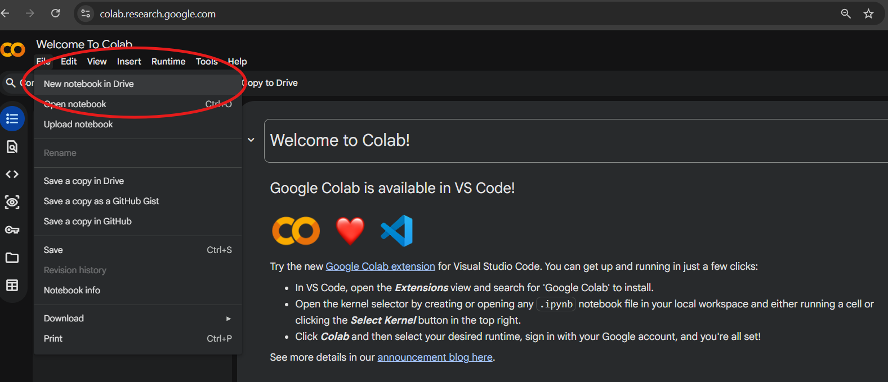
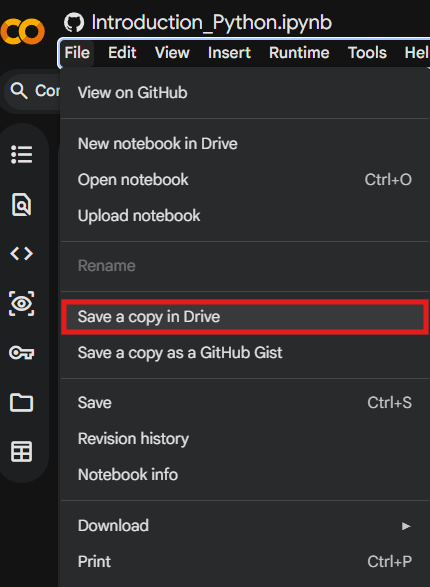

## 1. What Is a Python Notebook?

A **Notebook** is an interactive computing environment that allows you to combine:

- Code (Python)
- Text explanations
- Mathematical equations
- Tables and visualizations
- Results and outputs

All in a single document!

Jupyter Notebooks are especially useful for:

- Data exploration, cleaning, & analysis  
- Teaching and learning Python  
- Prototyping models  
- Sharing reproducible research  

Instead of writing a script and running it all at once, you work in **small, executable blocks called cells**. An example of this would be using the **Notebook** feature in ArcGIS Pro Desktop. 

---

## 2. Why Data Scientists Use Python Notebooks ?

Python Notebooks support an **iterative workflow**:

1. Write a few lines of code  
2. Run them immediately  
3. Inspect the output  
4. Modify and rerun as needed
5. Move on to next step and repeat!  

### Key Advantages

- Immediate visualization of data  
- Easy experimentation  
- Built-in documentation using Markdown  
- Reproducible analysis  
- Simple sharing with collaborators  

---

## 3. Getting Started: Opening a Notebook

You can use Jupyter Notebooks in several ways, one such way is:

- [Google Collab](https://colab.research.google.com). You would need a google account for this. Then create a new notebook in Drive. 

### Quick Start in Google Colab (easiest for beginners)

1. Go to https://colab.research.google.com
2. Click **File → New notebook**
3. You're ready! No installation needed.

#### Why Run this online ?

- Ease of Usage and Free 
- Colab runs in the cloud → you only need a Google account and internet 
- **Most** Python packages/libraries are pre-installed! 

**Note**: To SAVE your changes made, make sure to Save a copy of the notebook in your Drive! 

---

:::::::::::::::::::::::::::::::::::::: Activity

#### Option 1: Want to Learn the Basics of Python ? Go through cells *1-12*.

#### Option 2: Already know the basics ? Scroll down to cell *13*.

Check out this Notebook [Here]() to get you started with the usage of Python in Colab and its Libraries. 

::::::::::::::::::::::::::::::::::::::::::::::::

